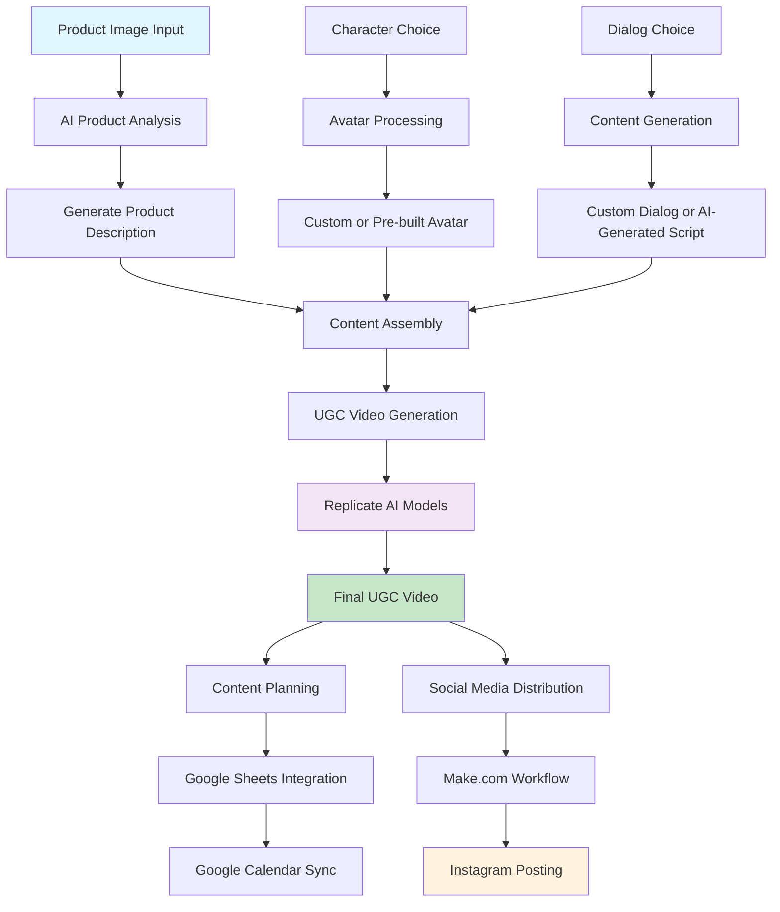

# AI Marketing Agent: UGC Ads Creator

## Problem Statement

The digital advertising industry faces a critical challenge: creating high-quality UGC (User Generated Content) ads is prohibitively expensive and time-consuming. Traditional agencies charge $500-2000 per video and take weeks to deliver, while existing AI tools like [Creatify.ai](https://creatify.ai/about) lack the intelligent workflow orchestration and human-in-the-loop capabilities that marketing teams need.

For founders running multiple SaaS products or e-commerce stores, maintaining consistent social media presence is an additional challenge. They struggle to create engaging content regularly, manage posting schedules across multiple platforms, and maintain brand consistency while focusing on core business operations.

**Current Pain Points:**

- **Time**: Manual UGC creation takes 1-3 weeks per video
- **Cost**: Agency fees range from $500-2000 per single ad
- **Complexity**: Multiple tools required for different workflow stages
- **Quality**: Limited human oversight in AI-generated content
- **Scalability**: No unified system for content planning and distribution
- **Content Management**: Founders and e-commerce owners struggle to maintain consistent social media presence
- **Posting Frequency**: Manual posting is time-consuming and often inconsistent
- **Multi-Platform**: Managing content across different social media platforms requires multiple tools and workflows

## Our Solution

We built an intelligent AI marketing agent using Portia AI that automates the entire UGC creation workflow while maintaining human creativity and oversight. Our agent transforms weeks of work into minutes, reducing costs by 95% while improving content quality.

## What Our Agent Can Do

### Workflow Overview

### Core Capabilities

1. **Smart Product Analysis**: AI-powered image understanding and description generation
2. **Intelligent Content Creation**: Auto-generated ad scripts with human refinement options
3. **UGC Video Generation**: Creates professional talking avatar videos
4. **Flexible Avatar System**: Custom uploads or curated professional avatars
5. **Content Planning**: Google Calendar integration for content scheduling
6. **Social Media Integration**: Automated posting to Instagram (expandable to all platforms)

### Workflow Automation

- **Input**: Product image URL or uploaded image
- **Processing**: AI analysis, content generation, avatar processing
- **Output**: Professional UGC video with optimized captions
- **Distribution**: Automated social media posting and calendar scheduling

## Tools & Workflows Connected

### AI Models & Services

- **Replicate**: 3 specialized models for UGC generation
  - Flux-Schnell for image generation
  - Claude-4-Sonnet for content analysis
  - Custom UGC video creation model
- **OpenAI GPT-4**: Content generation and refinement
- **Cloudinary**: Image hosting and optimization

### Workflow Automation

- **Make.com**: Social media posting and content calendar management
- **Google Sheets**: Content planning and scheduling data
- **Google Calendar**: Visual content calendar with automated sync

### Portia AI Framework

- **PlanBuilderV2**: Structured workflow definition
- **Execution Hooks**: Custom workflow control and verification
- **Clarification System**: Human-in-the-loop decision points
- **Tool Registry**: MCP protocol integration for 1000+ APIs

## Why Our Agent Solves a Real Problem

### Time Comparison

| Traditional Method          | Our AI Agent                 |
| --------------------------- | ---------------------------- |
| **1-3 weeks** per video     | **30 minutes** per video     |
| Manual script writing       | AI-generated scripts         |
| Model hiring & coordination | Automated avatar processing  |
| Video editing & production  | AI-powered video generation  |
| Content approval cycles     | Human-in-the-loop refinement |

### Cost Comparison

| Traditional Method      | Our AI Agent          |
| ----------------------- | --------------------- |
| **$500-2000** per video | **$5-10** per video   |
| Agency fees             | AI model costs only   |
| Model compensation      | No human talent costs |
| Production overhead     | Automated workflow    |
| Revisions & changes     | Instant iterations    |

### Business Impact

- **95% cost reduction** for UGC content creation
- **99% time savings** in content production
- **Professional quality** without agency expertise
- **Scalable workflow** for marketing teams
- **Consistent brand voice** across all content

### For Founders & E-commerce Owners

- **Automated Content Pipeline**: Generate weeks of content in hours
- **Consistent Posting**: Maintain regular social media presence without daily effort
- **Multi-Platform Management**: Handle Instagram, Twitter, Facebook from single interface
- **Content Calendar**: Visual planning and automated scheduling
- **Brand Consistency**: AI maintains your brand voice across all content

## What Makes Our Agent Unique

### Multi-Modal AI Workflow

Unlike existing tools that handle single aspects of content creation, our agent orchestrates multiple AI models in a unified workflow:

- Image analysis → Content generation → Avatar processing → Video creation → Distribution

### Human-in-the-Loop Intelligence

Strategic clarification points allow users to refine AI-generated content while maintaining workflow efficiency, balancing automation with human creativity.

### End-to-End Integration

From product input to social media posting, our agent handles the complete workflow without requiring multiple tools or manual intervention.

### Content Calendar Management

Seamlessly connects planning (Google Sheets) with execution (Google Calendar), creating a unified content management ecosystem.

## Technical Architecture

### Portia AI Integration

- **Controllable Agent Framework**: Structured planning with human oversight
- **Execution Hooks**: Custom workflow control and verification
- **Tool Connectivity**: 1000+ API integrations via MCP protocol
- **Clarification System**: Human decision points for content refinement

### User Interfaces

- **CLI Interface**: Developer-friendly command-line tools for automation
- **Streamlit Web Interface**: Intuitive workflow management for non-technical users

## Demo Video

[Video demo will be added here - showing end-to-end workflow from product input to UGC generation]

## Future Roadmap

### Phase 2: Multi-Platform Expansion

- Twitter/X, Facebook Business, LinkedIn, TikTok integration
- Advanced analytics and performance tracking

### Phase 3: Enterprise Features

- Team collaboration tools and brand guideline enforcement
- Multi-language support and compliance workflows

## Conclusion

Our AI Marketing Agent represents the future of content creation - where human creativity meets AI automation through Portia's powerful framework. We've built not just a tool, but a complete ecosystem that transforms how businesses approach UGC marketing.

By reducing content creation time from weeks to minutes and costs from thousands to dollars, our agent democratizes professional-quality marketing content for businesses of all sizes.

---

**Built with Portia AI for AgentHack 2025**
**Team**: Nishit Bariya (Team Leader), Vinayak Vispute
